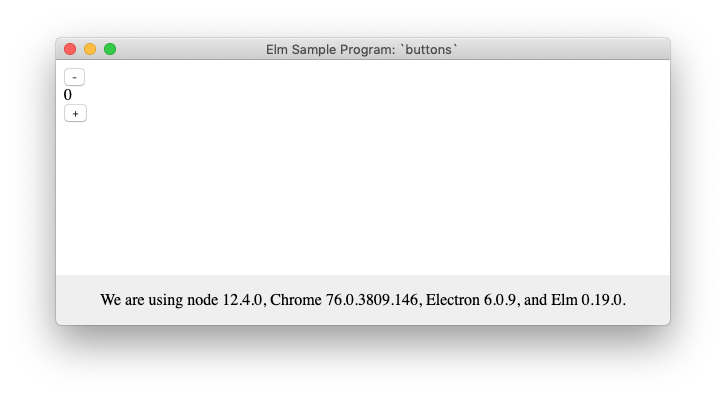

_last update: 28 September 2019_

# Elm and Electron
This project uses the
[Electron](https://electronjs.org/) destop-application framework,
but it is written in [Elm](https://elm-lang.org) rather than JavaScript.

# The `Buttons` App
This example implements the [first sample
program](https://guide.elm-lang.org/architecture/buttons.html) of the official
Elm guide, [An Introduction to Elm](https://guide.elm-lang.org).

All it does is show a number and two buttons.
The buttons allow you to increment and decrement the number.

# How To Get the App Up and Running

If these instructions don't work for you, I strongly recommend that you look at
John Omar's [guide](https://github.com/johnomarkid/elm-electron-webpack),
instead. There's a section below that explains why.

These steps assume MacOS, using the HomeBrew package manager. I wish I could
give advice for other environments, but those are outside of my wheelhouse.

## Install Prerequisites
- [Homebrew](https://brew.sh/)
  - $ `/usr/bin/ruby -e "$(curl -fsSL https://raw.githubusercontent.com/Homebrew/install/master/install)"`
- [node](https://nodejs.org/en/) & [npm](https://www.npmjs.com/) (via Homebrew)
  - $ `brew install node`
- [Electron](https://electronjs.org/)
  - $ `npm install -g electron`
- [Elm](https://guide.elm-lang.org/install.html)
  - [installer-for-mac.pkg](
  https://github.com/elm/compiler/releases/download/0.19.0/installer-for-mac.pkg)

## Clone the Repo and Install Dependencies
- $ `cd ` _your-development-directory_
- $ `git clone https://github.com/perlmonger42/elm-electron-webpack`
- $ `cd elm-electron-webpack`
- $ `npm install`

## Launch the Development Server
For development purposes, you run a local web server to service the app
(this part won't be necessary for a shrink-wrapped shipping version of the app).
- $ `npm run dev-server`

## Launch the Electron Application
You need to leave the dev server running,
so open a new terminal window for this.
- $ `cd` _your-development-directory_`/elm-electron-webpack`
- $ `cd npm run app`

If all goes well, you should see an Electron application window:

# Kudos to John Omar
This project was created under the guidance of John Omar's
[Elm/Electron/Webpack](https://github.com/johnomarkid/elm-electron-webpack)
guide.  In addition, [MainShayne233's pull request](
https://github.com/johnomarkid/elm-electron-webpack/pull/8) was also very
helpful, because the repo's dependencies have all continued to evolve since
John's repo was last updated.

# We Don't Need No Stinking Templates
If you're considering using this project as a template, my advice is: _don't_.
Instead, use the [`README.md`](
https://github.com/johnomarkid/elm-electron-webpack/blob/master/README.md)
in John's repo as a step-by-step guide to construct your own.  As he says,

> # A guide, not a template
> 
> You can find starter templates for a lot of frameworks in the javascript
> ecosystem. They aren't helpful. Templates make your life harder. When something
> goes wrong or your code veers slightly from the template, you'll be fighting a
> beast that you likely do not understand. More so, the template probably includes
> packages and settings that you don't need.

And he's right.  I found his guide _way_ more helpful than any of the many
templates I tried, for precisely the reasons he gives.

# Versions
These are the versions used to build this project.
- MacOS Mojave (10.14.6)
- Node 12.4.0 (javascript: `process.versions.node`)
- Chrome 76.0.3809.146 (javascript: `process.versions.chrome`)
- Electron 6.0.9 (javascript: `process.versions.electron`)
- Elm 0.19.0. (shell: `elm --version`)
- Webpack 6.11.3 (shell: `npm run webpack --version`)
